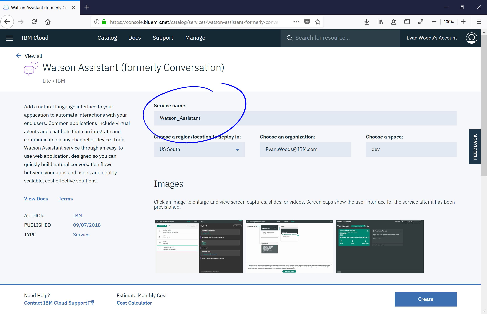

# Watson Assistant Tutorial: GUI

## Setup

In this method the user uses the Watson service to classify and train the system. The service is really simple to utilize. Even non-programmers can train Watson to detect the objects without coding. The following steps show how to create your own classifier.

1. **Create a Bluemix account.**

IBM Bluemix is a cloud platform with over 150 services, including all of Watson APIs. To get started visit [https://console.bluemix.net/](https://console.bluemix.net/) and create an account.

 

2. **Create Watson Assistant**

In this part, click on &quot;Create resource&quot; at the top right of the page and choose &quot;Watson&quot; from the left panel beneath &quot;Platform&quot;. Then choose &quot;Watson Assistant&quot; service.

 

Next step is to determine the name of the project and create it. Also at the bottom of the page the user can choose the lite (free) or paid account.

 

In the next page the Watson Assistant service shows you the credentials &quot;apikey&quot; which will be used for programming in a language. These are unnecessary for completing the assignment with the tooling method. Now the user should press the &quot;launch tool&quot; button.

 

In the next page, the user can click &quote&;Workspaces&quote&; and &quote&;create&quote&; to create their unique workspace for their virtual assistant.

There are three steps to complete to create a virtual assistant. They involve creating intents, entities, and dialogues. In the following example, we are going to create our own intents to toggle a light in a smart home.

## Intents
Intents define the action an assistant is meant to take. For example, you can instruct an assistant to turn an object on or to give the most recent Clemson football scores. In order to create an intent, click the &quot;Add intent&quot; button. 

To define an intent, give it a name beginning with a \#. Next, give a few examples of phrases that will be recognized by the intent. For example, you can expect the assistant to recognize &quot;Turn on the lights&quot; and be motivated to turn the lights on. Give at least 5 examples before moving on to the next step.   

## Entities

Entities define the object as user is taking an action on. Entities are generally nouns such as light, chair, or Clemson. Entities are used to refine the action a user is motivated to act upon. For example in the sentence &quot;Turn on the lights&quot; the lights are what a user would like to turn on. Begin to add your own entities by clicking &quot;Add entity&quot;. 

First, give the entity a name beginning with the @ symbol. Then add a value for that entity, and a few synonyms to that value. You can imagine an entity to be the overarching label, and the value to be the object. If you desire, you can have synonyms suggested for you. 

## Dialogue
The dialogue is the flow of conversation which ties the intentes and entities together. To begin a new dialogue, click the &quot;Create&quot; button to add a new dialogue flow.

There will always be two dialogue nodes when a new dialogue is created the first is the &quot;Welcome&quot; node which is the first message that is displayed when a dialogue is initiated. The second node is the &quot;Anything else&quot; node which generate a response if no nodes are triggered. It is important to know that the assistant will try to trigger nodes from the top node down iteratively. To create a new node, click on the three vertical dots and select &quot;Add node below&quot;. Next, name the node. It is good practice to name the node with the intent or entity the node is being used to match. In the following example, the new node is called &quot;\#Turn_on&quot; and will trigger if the assistant recognizes the \#Turn on intent. For now, leave the text response blank.
\
To test your dialogue for correctness, click the &quot;Try it out&quote; button to chat with your assistant. In the following example, the response was selected to be an image, and the link address to the image of a lightbulb found through Google was used as the Iamge source.

What if many were devices were connected to the assistant, and we needed to specify which device we want to turn on? We could do so by clicking the three vertical buttons and selecting &quot;Add child node&quot;. Next we define the node to trigger if the assistant recognizes the lights entity. Finally, we connect the intent to the entity by selecting the intent, changing &quot;Wait for user input&quot; to &quot;Jump to ...&quot;, and selecting the lights entity child node. This will create a dialogue flow such that if the assistant recognizes the \#Turn_on intent, and the assitant will directly check what the user desires to turn on. If the user specifies the lights entity, then the bot will respond and turn on the lights.

In the following example, intents and dialogue flows are created to turn lights both on and off. 

