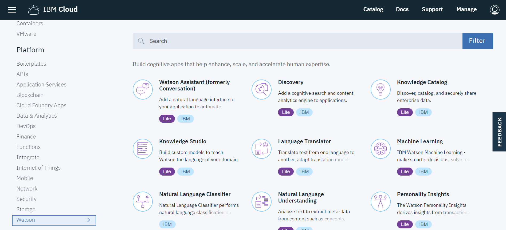
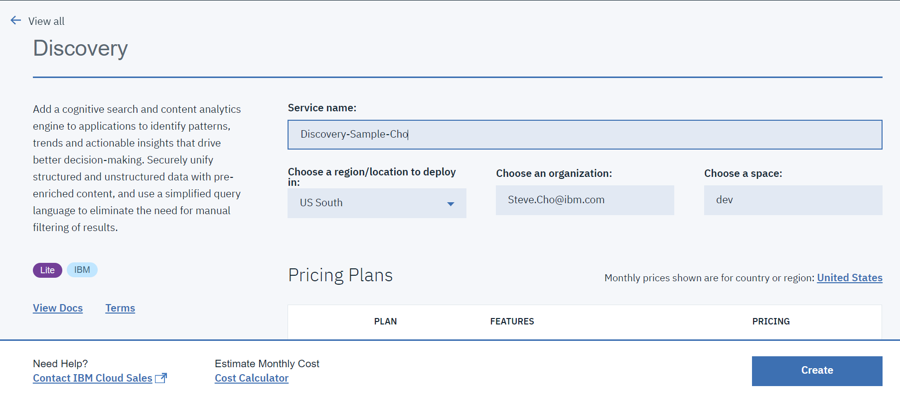
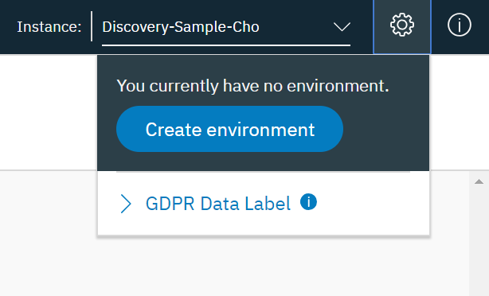
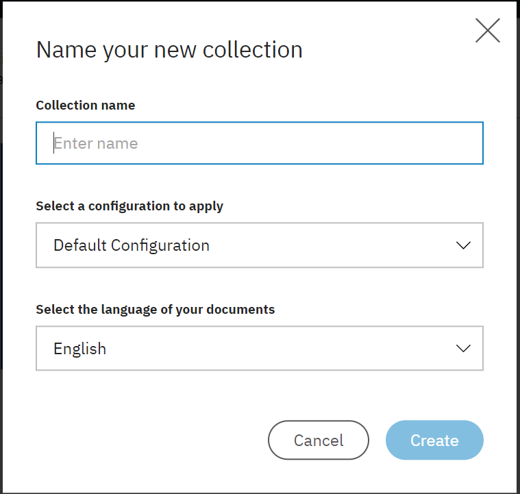
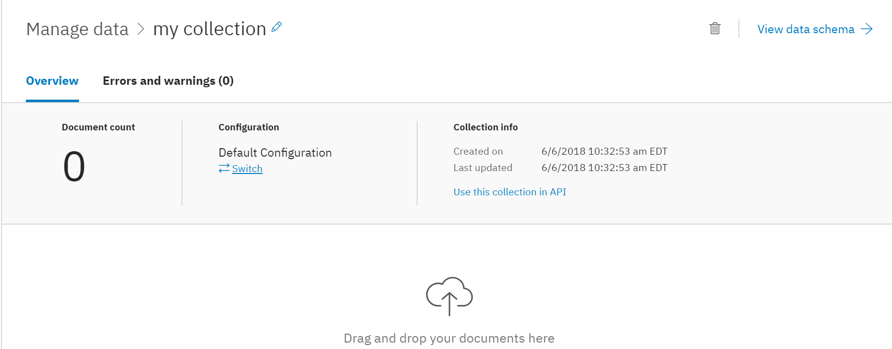
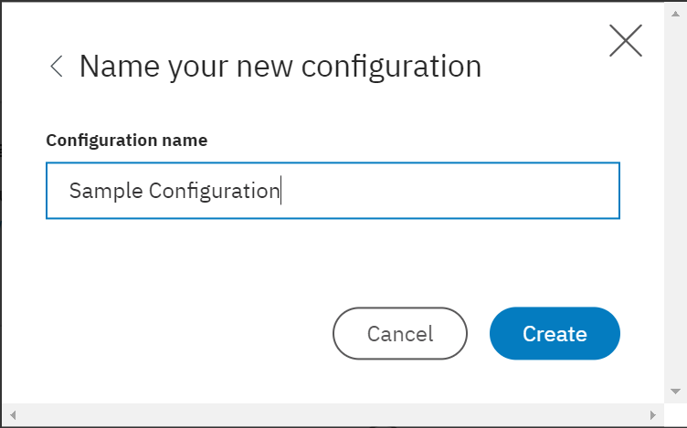
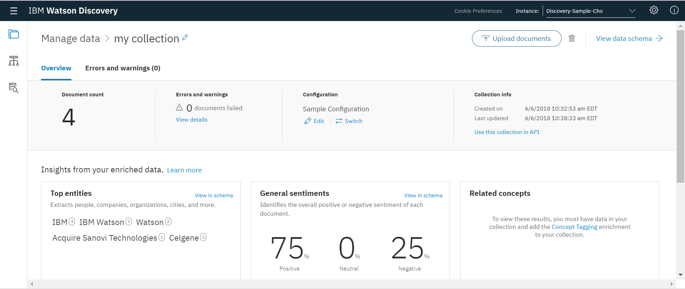
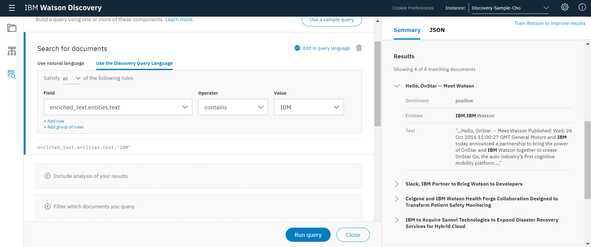
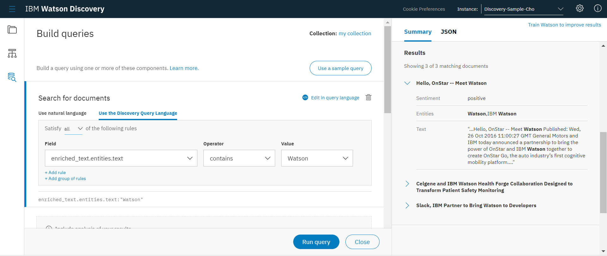
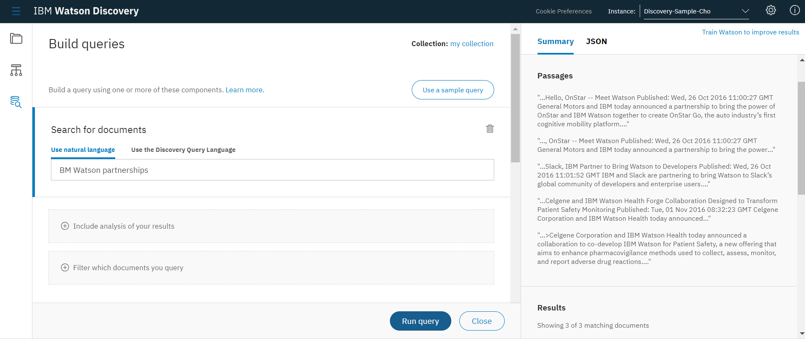

# IBM-Watson-Discovery: How to use the IBM Watson Discovery service with Tooling(GUI)

## What is Watson Discovery?
  Watson Discovery service helps you unlock hidden value in data to find answers, monitor trends and surface patterns with the world’s most advanced cloud-native insight engine.
  
  - Background: Thesedays, we face an explosion of data, unstructured and structured content. The analysis of structured content – numbers, dates, organized groupings of words, which tell us what is happening – has been largely conquered with traditional analytics systems.
  
  - Current issues: the analysis of unstructured content presents continuing challenges. But it’s precisely unstructured content, like product reviews, social media and images, that tells us why things are happening.
  
  - Watson Discovery Service tackles this challenge. It lets developers rapidly build cognitive apps that extract value from structured and unstructured data. With the Watson Discovery Service, developers spend less time cleaning up and acquiring their data, and much more time analyzing and exploring it.
  
      1) Easily ingest and normalize enormous amounts of unstructured proprietary and publicly available content—even if you have little or no systems engineering and machine learning skills
      2) Exploit third-party pre-enriched news data to enable highly targeted search and trend analysis
      3) Apply natural language processing and artificial intelligence capabilities to go far beyond simple keyword searches
      4) Perform multiple query types including boolean, filter and aggregation to discover patterns, trends and answers
      5) Easily add your Watson Discovery Service data to existing applications using REST APIs

Before getting into the service setup, Let's define all the terms you see in the documents.

  1) Environment — The environment defines the amount of storage space that you have for content in the Discovery service.
                   A maximum of one environment can be created for each instance of the Discovery service.
  2) Collection — A collection is a grouping of your content within the environment.
                  You must create at least one collection to be able to upload your content.
  3) Discovery News - a public data set that has been pre-enriched with cognitive insights, which is included in Discovery Collection.

## Step1: Create Watson Discovery and a service instance

   1. Sign up for a [free IBM Cloud account or log in](https://console.bluemix.net/)
   2. In the [IBM Cloud Catalog](https://console.bluemix.net/catalog/), Choose "Watson" from the left All "Categories". Then choose "Discovery" service.
   
   
  
  
   3. Enter Service name, Choose proper option in each colume, Click one of proper pricing plans
   4. Click Create.
   
   
   

  
## Step2: Launch the tool

  After you create an instance of the Discovery service, Click on your Discovery service instance to go to the Discovery service dashboard  

## Step3: Create an environment and a collection
   
   The environment gets you storage space that you can use for the Discovery service and a collection is a set of your documents.
 
   1. Click Cog at the top right and choose Create environment.
   
      

   2. When your environment is ready, the Name your new collection dialog appears. Name your collection and choose Default Configuration from Select a configuration to apply (you can change the configuration later).
 
   
   

       
      
## Step4: Create a custom configuration

   After your collection is created, you could immediately start uploading content using the upload area, but I want to tell you how to create and test a custom configuration.
   
   1. Click Switch next to the collection name and choose Create a new configuration. Name your configuration and click Create.
   
   
   
   
   
   2. After you create your configuration, you can customize it:
        1) Download the [test-doc1.html](https://watson-developer-cloud.github.io/doc-tutorial-downloads/discovery/test-doc1.html) sample document.
        2) Use the Upload Sample Documents panel to upload the sample document. After it uploads, you can click the document name link to view the transformation.
        
    3. Now it's time to adjust the configuration. For this task, you change the enrichments that are applied to each document:
        1) Click on the Enrich section of the configuration. Look at the generated JSON to the right of the screen. Scroll down to the enriched_text section and notice that it contains many concepts.
        2) Next, remove the text enrichment named concepts by clicking the X next to it and then click Apply & Save.
        3) Finally, look at the JSON again. Notice how the output has changed and no longer includes concepts.
        

    
    
## Step5: Upload your documents

   When you're happy with the custom conversion of your sample document, it's time to ingest the real content into your collection.
   
   1. Download these three sample documents: [test-doc2.html](https://watson-developer-cloud.github.io/doc-tutorial-downloads/discovery/test-doc2.html), [test-doc3.html](https://watson-developer-cloud.github.io/doc-tutorial-downloads/discovery/test-doc3.html), [test-doc4.html](https://watson-developer-cloud.github.io/doc-tutorial-downloads/discovery/test-doc4.html)
   2. Click File icon and select your collection.
   3. Make sure the custom configuration you created is listed under Configuration. If it isn't, click Switch next to the configuration name and select it.
   4. Click the Upload documents button and start uploading the four sample documents: test-doc1.html, test-doc2.html, test-doc3.html, test-doc4.html.
   5. Wait for the documents to upload. The status of your documents display in the Overview section
   
   

## Step6: Build a query

   When you're happy with the custom conversion of your sample document, it's time to ingest the real content into your collection.
   
   1. Click Query icon on the left to open the query page. Select your collection and click Get started.
   
   2. On the Build queries screen, click Search for documents, then Use the Discovery Query Language:
    
    - To search for results with entities named "IBM":
          
      a) Click Field and select enriched_text.entities.text. 
      Select contains for Operator and IBM for Value. 
      The query enriched_text.entities.text:IBM is displayed in Visual Query Builder.
   
      b) Click Run Query. The query returns 4 results.
          
    - To search for results with entities named "Watson":
          
      a) Click Field and select enriched_text.entities.text. 
      Select contains for Operator and watson for Value. 
      The query enriched_text.entities.text:watson is displayed in Visual Query Builder.
          
      b) Click Run Query. The query returns 3 results.
          
3. You can also click Use natural language and write a natural language query, such as "IBM Watson partnerships".
    

